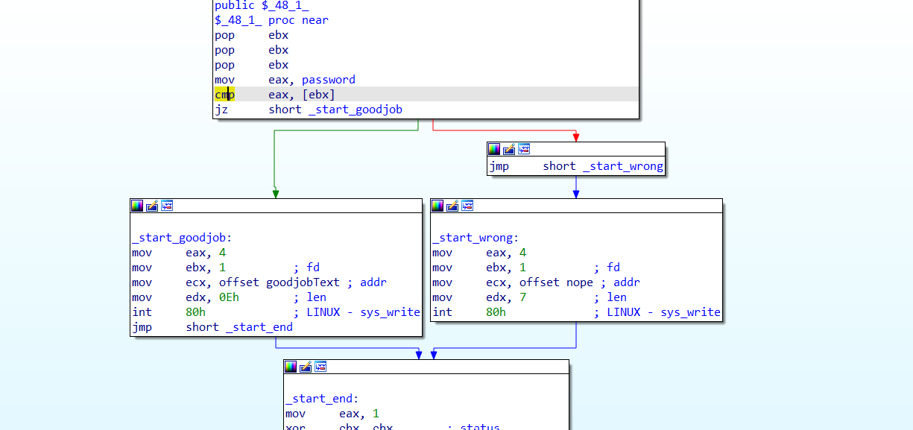
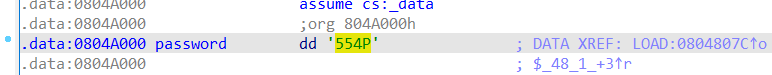

# **Es crack**

# Task
File : run.exe

Chạy thử file :

Chú ý: vì mình chạy file này trên Windows Subsystem Linux nên file chạy bình thường, bản chất file này là file linux mặc dù extension là `.exe`

```bash
└─$./ run.exe
        Segmentation fault
└─$./ run.exe hello
        Wrong !
```
Lần đầu tiên ta chạy file thì thấy lỗi `Segmentation fault` nên ta thử chạy file với tham số truyền vào

Vậy ở challenges này sẽ kiểm tra tham số truyền vào trực tiếp khi chạy chương trình

Nếu nhập sai sẽ in ra `wrong`

## Solution

Đầu tiên ta chạy lệnh `file` để kiểm tra file 32bit hay 64bit

```bash
└─$ file run.exe
run.exe: ELF 32-bit LSB executable, Intel 80386, version 1 (SYSV), statically linked, with debug_info, not stripped
```
Ở đây ta thấy file này là 32bit và thuộc Linux :))

File 32bit nên ta dùng IDA pro 32 bit để reverse và phân tích file này



Đọc code ta thấy code sẽ nhận tham số truyền vào ở thanh ghi `ebx` và so sánh với `password` có sẵn được lưu trong chương trình 

Nhảy tới nơi lưu `password` ta thấy có giá trị là `554P` được lưu dưới dạng LSB nên chuỗi chúng ta truyền vào sẽ là `P455`




## Chạy chương trình với chuỗi `P445`

```bash
└─$ ./run.exe P455
You Got This!
```

Done!