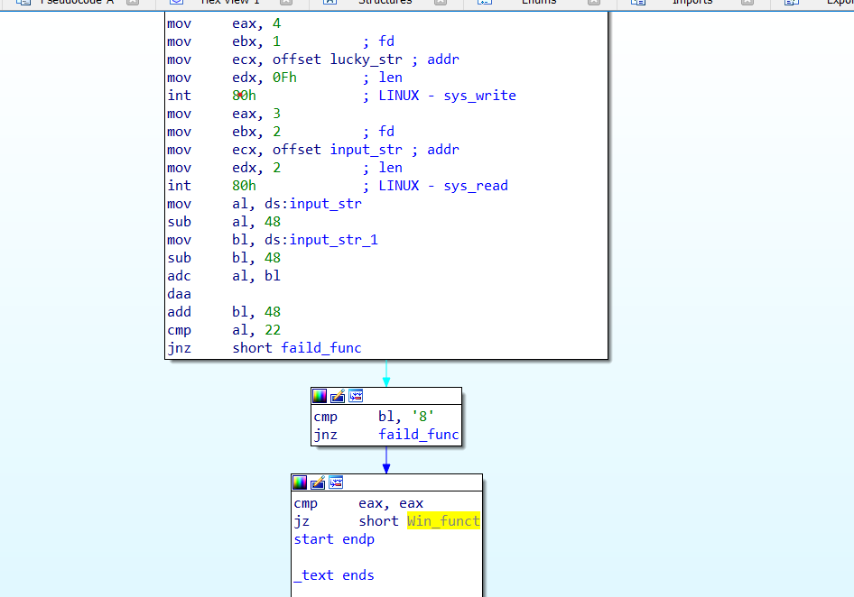

# **Lucky**

# Task
File: lucky_nb

Chạy thử file: 
```bash
└─$ ./lucky_nb
Lucky Numbers: ab
Sorry :((
└─$ ./lucky_nb
Lucky Numbers: 12
Sorry :((
└─$ ./lucky_nb
Lucky Numbers: 123123
Sorry :((
└─$ 3123
3123: command not found
```

ở đây chương trình sẽ nhập một chuỗi hoặc một số,
chỉ gồm hai chữ số, nếu nhập vào nhiều hơn 2 ký tự chương trình sẽ chỉ lấy 2 ký tự đầu tiên

## Solution

Đầu tiên ta chạy lệnh `file` để kiểm tra file là 32bit hay 64bit

```bash
└─$ file lucky_nb
lucky_nb: ELF 32-bit LSB executable, Intel 80386, version 1 (SYSV), statically linked, stripped
```

Phân tích bài này với IDA pro 32bit



Đọc đoạn code assembly, ta thấy `input` nhập vào sẽ chia làm hai phần

ở ký tự đầu tiên (`input_str` lưu và `al`) sẽ được trừ đi `48` 
ở ký tự thứ hai (`input_str_1` lưu vào `bl`) sẽ được trừ đi `48`

cuối cùng hai số sẽ được cộng lại bằng lệnh `adc` và được format giá trị ở dạng `packed BCD` bằng lệnh `daa`


So sánh `al` (chính là tổng của `al` với `bl`) với giá trị `22` nếu bằng sẽ (thực hiện cộng giá trị của `input_str_1` ký tự thứ 2 với `48` để khôi phục giá trị của `input_str_1` trước khi trừ `48`) so sánh với ký tư `8` 

vậy `number` sẽ có dạng X8 với X ký tự cần tìm để:
`daa((X-48) + ('8'-48)) == 22`

với `daa` dùng để format giá trị của lệnh `adc` sau khi cộng
để `daa(value) = 22` thì `value = 16`

=> `X = 8`

vậy `number` nhập vào là `88`

## chạy chương trình với `number` vừa tìm được 

```bash
└─$ ./lucky_nb
Lucky Numbers: 88
Good Job !
```
Done !
