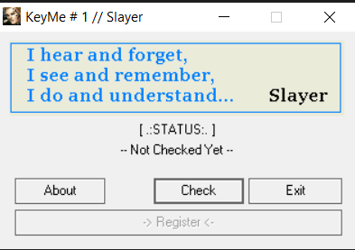
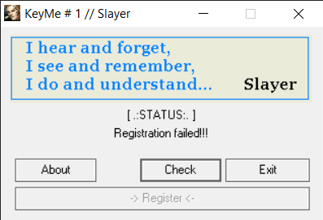
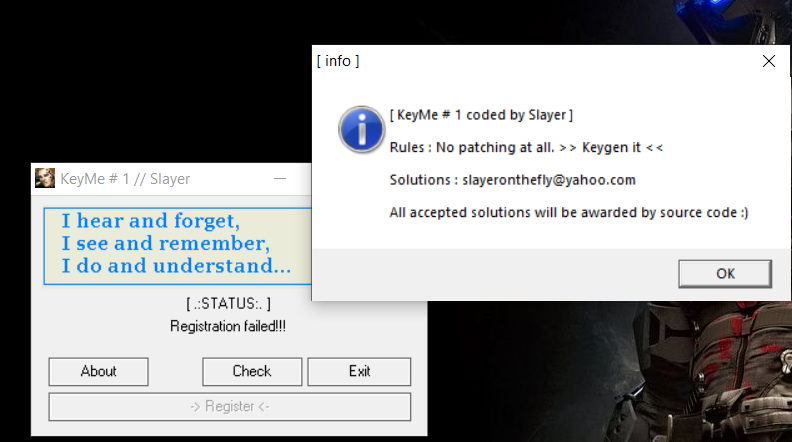
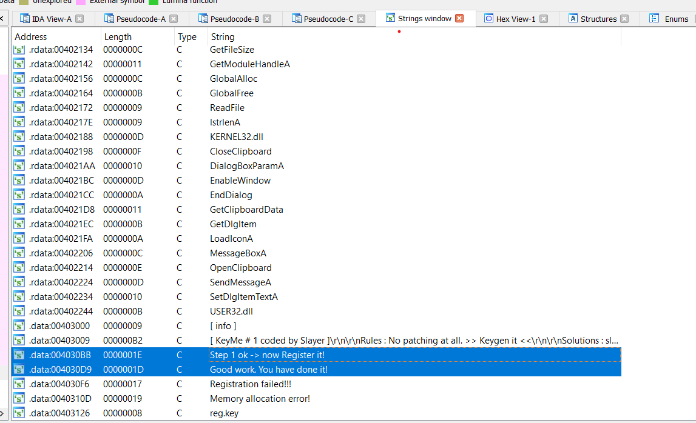
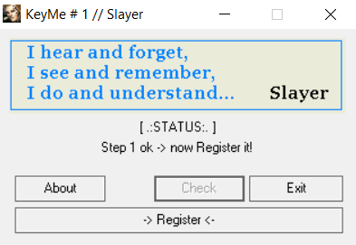
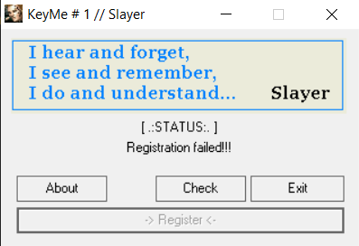
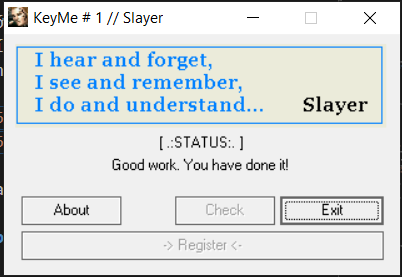

# **S_Crackme1**

# Task 
File: KeyMe1.exe 

Chạy thử file:




Mới đầu khi test thử chương trình này thì mình không biết mục đích của bài này là làm gì, tuy nhiên khi phân tích vô sâu thì mình thấy challenge này khá là hay!

## Solution

Chạy lệnh `file` để kiểm tra file
```bash
└─$ file KeyMe1.exe
KeyMe1.exe: PE32 executable (GUI) Intel 80386, for MS Windows
```

File 32bit nên ta sử dụng IDA pro 32 bit để reverse và phân tích file

Như các bài khác thì bước đầu tiên mình luôn xem trong cửa sổ string xem IDA đã xác định chương trình có những chuỗi nào



Thì ở đây mình phát hiện ra hai chuỗi mà mình nghi ngờ cho nên hình tập trung vào hai chuỗi này:

`Step 1 ok -> now Register it!`

`Good work. You have done it!`

Nhảy tới nơi chương trình in ra hai chuỗi này và sử dụng giao diện pseudocode để phân tích:


Vì đây là ứng dụng có giao diện nên source khá là dài và mất hơi nhiều thời gian để phân tích. Tuy nhiên, sau một hồi phân tích kĩ thì mình thấy chương trình tập trung xử lí ở hàm này khi chúng ta nhấn các button:

```c
INT_PTR __stdcall DialogFunc(HWND hWnd, UINT a2, WPARAM a3, LPARAM a4)
{
  HICON v4; // eax
  unsigned int v5; // kr00_4
  CHAR *v6; // esi
  unsigned __int8 v7; // al
  unsigned __int16 v9; // ax
  HANDLE v10; // eax
  DWORD v11; // eax
  HGLOBAL v12; // eax
  HANDLE clip_board_value; // eax
  unsigned int v14; // kr04_4
  int v15; // ecx

  if ( a2 != 272 )
  {
    if ( a2 == 16 )
      EndDialog(hWnd, 0);
    if ( a2 != 273 )
      return 0;
    v9 = a3;
    if ( (_WORD)a3 == 104 )
      v9 = EndDialog(hWnd, 0);
    if ( v9 == 105 )
      v9 = MessageBoxA(0, Text, Caption, 0x40u);
    if ( v9 != 106 )
    {
LABEL_24:
      if ( v9 == 103 )
      {
        OpenClipboard(0);
        clip_board_value = GetClipboardData(1u);
        if ( !clip_board_value )
          goto fail_reg;
        eax_assign = (int)clip_board_value;
        v14 = __readeflags();
        dword_403342 = const_1095;
        v15 = const_15;
        do
        {
          dword_403342 -= *(unsigned __int8 *)(v15 + eax_assign - 1);
          --v15;
        }
        while ( v15 );
        __writeeflags(v14);
        if ( dword_403342 )
        {
fail_reg:
          SetDlgItemTextA(hWnd, 102, aRegistrationFa);
        }
        else
        {
          SetDlgItemTextA(hWnd, 102, aStep1OkNowRegi);
          EnableWindow(dword_403356, 0);
          EnableWindow(::hWnd, 1);
        }
        CloseClipboard();
      }
      return 0;
    }
    v10 = CreateFileA(FileName, 0x80000000, 1u, 0, 3u, 0x80u, 0);
    if ( v10 == (HANDLE)-1 )
      goto LABEL_22;
    hFile = v10;
    v11 = GetFileSize(v10, 0);
    if ( v11 < 8 )
    {
      CloseHandle(hFile);
LABEL_22:
      SetDlgItemTextA(hWnd, 102, aRegistrationFa);
      EnableWindow(::hWnd, 0);
      EnableWindow(dword_403356, 1);
      goto LABEL_23;
    }
    nNumberOfBytesToRead = v11;
    v12 = GlobalAlloc(64u, v11);
    if ( v12 )
    {
      lpBuffer = v12;
      if ( !ReadFile(hFile, v12, nNumberOfBytesToRead, &NumberOfBytesRead, 0) )
      {
        CloseHandle(hFile);
        GlobalFree(lpBuffer);
        goto LABEL_22;
      }
      CloseHandle(hFile);
      if ( dword_403342 + (*((_DWORD *)lpBuffer + 1) ^ *(_DWORD *)lpBuffer) != const_1095 )
        goto LABEL_22;
      SetDlgItemTextA(hWnd, 102, aGoodWorkYouHav);
      EnableWindow(::hWnd, 0);
    }
    else
    {
      SetDlgItemTextA(hWnd, 102, aMemoryAllocati);
      CloseHandle(hFile);
    }
LABEL_23:
    v9 = (unsigned __int16)GlobalFree(lpBuffer);
    goto LABEL_24;
  }
  v4 = LoadIconA(hInstance, (LPCSTR)0x3E8);
  SendMessageA(hWnd, 0x80u, 1u, (LPARAM)v4);
  dword_403356 = GetDlgItem(hWnd, 103);
  ::hWnd = GetDlgItem(hWnd, 106);
  nSize = 255;
  GetComputerNameA(String, &nSize);
  const_15 = lstrlenA(String);
  v5 = __readeflags();
  v6 = String;
  const_1095 = 0;
  do
  {
    v7 = *v6++;
    const_1095 += v7;
  }
  while ( v7 );
  __writeeflags(v5);
  return 0;
}
```


Sau khi mình debug thì mình thấy chương trình sẽ nhảy vào đoạn code này khi mà mình nhấn button `Check`
### chú ý: một số tên biến đã được mình phân tích và đổi tên sang các tên dễ phân biệt để dễ dàng cho quá trình phân tích và dịch ngược nên sẽ các khác so với nội dung mà lúc đầu IDA hiển thị
```c
    if ( v9 != 106 )
    {
LABEL_24:
      if ( v9 == 103 )
      {
        OpenClipboard(0);
        clip_board_value = GetClipboardData(1u);
        if ( !clip_board_value )
          goto fail_reg;
        eax_assign = (int)clip_board_value;
        v14 = __readeflags();
        dword_403342 = const_1095;
        v15 = const_15;
        do
        {
          dword_403342 -= *(unsigned __int8 *)(v15 + eax_assign - 1);
          --v15;
        }
        while ( v15 );
        __writeeflags(v14);
        if ( dword_403342 )
        {
fail_reg:
          SetDlgItemTextA(hWnd, 102, aRegistrationFa);
        }
        else
        {
          SetDlgItemTextA(hWnd, 102, aStep1OkNowRegi);
          EnableWindow(dword_403356, 0);
          EnableWindow(::hWnd, 1);
        }
        CloseClipboard();
      }
      return 0;
    }
```
và trong đoạn này cũng chưa cả nơi mà chương trình in ra chuỗi `Step 1 ok -> now Register it!`

Tiến hành phân tích hàm này, trong này có một số hàm lạ nên mình đã tìm hiểu sơ qua các hàm

Thì nội dung chính của đoạn code trên chính là chương trình sẽ mở `clipboard` (nơi lưu trữ các `copy` hoặc `cut` mà chúng ta vừa với thực hiên)

Sau đó đoạn tiếp theo sẽ lấy chuỗi trong `clipboard` gần nhất rồi thực hiện trừ một biến hằng số `const_1095` cho các giá trị trong `clipboard` với số lần lặp là 15 (`v5 = const_15`) vì hằng số `1095`  = `15 * 73` mà 73 chính là ký tự `I` nên `clipboard` của chúng ta là `IIIIIIIIIIIIIII` (`15` lần ký tự `I`)

## Thử copy chuỗi đó và chạy chương trình


Khi ta nhấn vào button `Check` thì chuỗi mà chúng ta muốn đã được in ra và button `Register` được enable, vậy ta đã xong bước đầu

Tiếp theo ta nhấn vào button `Register`



Kết quả vẫn sai, chương trình vẫn chưa in ra chuỗi thứ 2 mà ta muốn, vậy ta tiếp tục phân tích chương trình


```c
  v10 = CreateFileA(FileName, 0x80000000, 1u, 0, 3u, 0x80u, 0);
    if ( v10 == (HANDLE)-1 )
      goto LABEL_22;
    hFile = v10;
    v11 = GetFileSize(v10, 0);
    if ( v11 < 8 )
    {
      CloseHandle(hFile);
LABEL_22:
      SetDlgItemTextA(hWnd, 102, aRegistrationFa);
      EnableWindow(::hWnd, 0);
      EnableWindow(dword_403356, 1);
      goto LABEL_23;
    }
    nNumberOfBytesToRead = v11;
    v12 = GlobalAlloc(64u, v11);
    if ( v12 )
    {
      lpBuffer = v12;
      if ( !ReadFile(hFile, v12, nNumberOfBytesToRead, &NumberOfBytesRead, 0) )
      {
        CloseHandle(hFile);
        GlobalFree(lpBuffer);
        goto LABEL_22;
      }
      CloseHandle(hFile);
      if ( dword_403342 + (*((_DWORD *)lpBuffer + 1) ^ *(_DWORD *)lpBuffer) != const_1095 )
        goto LABEL_22;
      SetDlgItemTextA(hWnd, 102, aGoodWorkYouHav);
      EnableWindow(::hWnd, 0);
    }
    else
    {
      SetDlgItemTextA(hWnd, 102, aMemoryAllocati);
      CloseHandle(hFile);
    }
```
sau khi đã xong bước 1 thì mình debug tiếp mà thấy chương trình sẽ nhảy vào đoạn code này khi mà chúng ta nhấn button `Register`

Để chương trình in ra chuỗi thứ 2 mà ta muốn 
thì đoạn code phải thực hiện tới lệnh: `SetDlgItemTextA(hWnd, 102, aGoodWorkYouHav);` 

Phân tích lên trên thì ta thấy , để code chạy tới dòng này thì hai dòng `if` trên phải sai 

`if ( v10 == (HANDLE)-1 )`  , `if ( v11 < 8 )`  -> sai

Đoạn `IF` đầu tiên:
```c
    v10 = CreateFileA(FileName, 0x80000000, 1u, 0, 3u, 0x80u, 0);
    if ( v10 == (HANDLE)-1 )
      goto LABEL_22;
    hFile = v10;
    v11 = GetFileSize(v10, 0);
```

chương trình thực hiện mở file nếu file không tồn tại thì tạo file mới và lưu loại (tạo hay mở từ file có sẵn) thực hiện vào trong `v10`. Nếu `v10==(HANDLE)-1` nghĩa là chương trình tạo file mới còn khác thì chương trình đã mở từ file đã có sẵn  -> vậy để câu `IF` sai thì file phải được tạo sẵn với `filename` được lưu sẵn trong chương trình: `reg.key`


Tạo file cùng thư mục và tiếp tục debug, ta thấy chương trình sẽ bỏ qua câu `if` và tiếp tục thực hiện đọc file sao đó kiểm tra nếu ký tự trong file mà nhỏ hơn `8` thì sẽ báo sai vậy ta phải thêm một chuỗi có độ dài >=8 trong file `reg.key` mà ta vừa tạo để bỏ qua câu `if` này


Sau đó để có thể khiến chương trình in ra dòng mong muốn thì ta phải bỏ qua được câu if này 

`if ( dword_403342 + (*((_DWORD *)lpBuffer + 1) ^ *(_DWORD *)lpBuffer) != const_1095 )`
thì kết quả của vế trái phải bằng hằng số `1095`

Ta debug sẽ thấy `dword_403342` không được set nên sẽ luôn bằng không

Trong code ta thấy lpBuffer là đang trỏ tới nội dung của file `reg.key` đọc vào chương trình cho nên đoạn trên chính là 4 bytes thấp và 4 bytes cao của chuỗi trong `reg.key` `xor` với nhau và so sánh với `1095`

vậy ta giả sử 4 bytes là `aaaa`(`0x61616161`) thì 4 `bytes` còn lại sẽ là `aae&` (`0x61616526`) vì `0x61616161^0x61616526` = `1095` (ở dạng LSB)

Vậy chuỗi được lưu trong file `reg.key` là `&eaaaaaa`

## Chạy chương trình với những gì ta vừa phân tích

`IIIIIIIIIIIIIII` -> copy clipboard
tạo file `reg.key` với nội dung `&eaaaaaa`



Done !