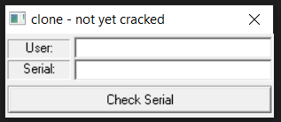

# **clone**

## Task 
File: clone.exe

Chạy thử file:



Ta đoán bài này sẽ yêu cầu tìm `serial` và `username` hợp lệ

## Solution

Đầu tiên ta chạy lệnh `file` để kiểm tra file là 32bit hay 64bit
```bash
└─$ file clone.exe
clone.exe: PE32 executable (GUI) Intel 80386, for MS Windows
```

Vậy file này là fiel 32bit

Tiến hành reverse file bằng IDA pro 32bit sau đó tiến hành phân tích 

Mở cửa sổ string để xem các chuỗi được IDA tìm được:


Ta thấy ngay chuỗi mà chúng ta muốn chương trình in ra `Well done! Now make good tutorial :)`

Nhảy tới vị trí mà chương trình in ra chuỗi này


Nhấn F5 để IDA hiện pseudocode của đoạn này


Phân tích ngược lên trên

Sau một hồi debug thì ta thấy chương trình sẽ nhảy vào kiểm tra ở đây sau khi nhập `username` và `serial` và nhấn `Check Serial`


Ở Câu lệnh IF đầu tiên 
ta biết ngay là độ dài của `username` phải lớn hơn `5` và độ dài của `serial` phải đúng bằng 8
### Chú ý: biến `username` và `serial` đã được mình tự đổi tên lại sau khi đọc code và debug chứ không phải IDA phát hiện ra ngay từ đầu

Đoạn code tiếp theo được chia làm hai phần chính
 ## Phần 1: lấy các giá trị từ phần tử thứ 4 của `username` sau đó thực hiện tính toán và lưu vào biến `dword_4030C8`
 ```c
         v4 = &username[4];
        v5 = 0;
        do
          v5 += *v4++;
        while ( *v4 );
        LOBYTE(v6) = v5;
        HIBYTE(v6) = v5;
        v7 = _byteswap_ulong(v6);
        LOBYTE(v7) = v5;
        BYTE1(v7) = v5;
        v8 = _byteswap_ulong(_byteswap_ulong(_byteswap_ulong(*(_DWORD *)username ^ v7) + 0x3022006) + 0x21523F22);
        LOBYTE(v8) = v8 + 1;
        ++BYTE1(v8);
        v9 = _byteswap_ulong(v8);
        LOBYTE(v9) = v9 - 1;
        --BYTE1(v9);
        v10 = _byteswap_ulong(
                *(_DWORD *)username
              + _byteswap_ulong(
                  _byteswap_ulong(
                    _byteswap_ulong(
                      _byteswap_ulong(_byteswap_ulong(_byteswap_ulong(_byteswap_ulong(v9) ^ 0xEDB88320) - 0x28955B88) + 0x4FF40532)
                    + 0xBADBEEF)
                  + 1)
                - 1));
        LOWORD(v10) = v10 + 1;
        v11 = _byteswap_ulong(v10);
        LOWORD(v11) = v11 + 1;
        dword_4030C8 = _byteswap_ulong(v11);
 ```

## Phần 2: lấy các giá trị của `serial`sau đó thực hiện tính toán và lưu vào biên `byte_4030B8`
```c
 v12 = 0;
        v13 = serial;
        while ( 1 )
        {
          v14 = *v13;
          if ( !*v13 )
            break;
          if ( (unsigned __int8)v14 < '0' )
            return 0;
          if ( (unsigned __int8)v14 > '9' )
          {
            if ( (unsigned __int8)v14 < 65u || (unsigned __int8)v14 > 70u )
              return 0;
            byte_4030B8[v12] = v14 - 55;
            ++v13;
            ++v12;
          }
          else
          {
            byte_4030B8[v12] = v14 - '0';
            ++v13;
            ++v12;
          }
        }
        if ( dword_4030C8 == _byteswap_ulong(
                               (unsigned __int8)(((byte_4030B8[7] + 16 * byte_4030B8[6]) ^ 0xCD) - 17)
                             + (((unsigned __int8)(((byte_4030B8[5] + 16 * byte_4030B8[4]) ^ 0x90) - 85)
                               + (((unsigned __int8)(((byte_4030B8[3] + 16 * byte_4030B8[2]) ^ 0x56) + 120)
                                 + ((unsigned __int8)(((byte_4030B8[1] + 16 * byte_4030B8[0]) ^ 0x12) + 52) << 8)) << 8)) << 8)) )
        {
          MessageBoxA(0, Win, Caption, 0x40u);
          SetWindowTextA(hWnd, aCloneDefeated);
        }
```
ở câu lệnh cuối thì `byte_4030B8` tiếp tục được thực hiện tính toán và so sánh với `dword_4030C8` nếu bằng nhau thì chuỗi chúng ta cần tìm sẽ được in ra.

## Kết luận hướng giải: `username` và `serial` sẽ phụ thuộc vào nhau trong chương trình này, cho nên chúng ta sẽ nhập một chuỗi `username` bất kỳ sau đó tính được `byte_4030C8` 
## Từ `dword_4030C8` có được ta sẽ tính ngược lại `serial` cần nhập cho `username` đó

Sau đây là code python dùng để dựng lại 2 phần đoạn code ở trên
```python
import struct

def swap32(i):
    return struct.unpack("<I", struct.pack(">I", i))[0]


def LOBYTE(num):
    return num & 0xFFFF


def HIBYTE(num):
    return num >> 16


def string_to_ASCII(str):
    res = 0
    for i in str[::-1]:
        res = res << 8
        res += ord(i)

    return res


serial = "12345678" # test
username = "abcde"


####### Phần 1:
v5 = 0

for i in range(4, len(username)):
    v5 += ord(username[i])
print(v5)

v6 = v5 << 8
v6 += v5

v7 = swap32(v6)


v7 += v5 << 8
v7 += v5

username_val = string_to_ASCII(username)
v8 = swap32(swap32(swap32((username_val ^ v7) &
            0xffffffff) + 0x3022006) + 0x21523f22)

v8 += 1
v8 = (((v8 >> 8) + 1) << 8) + (((v8 << 24) & 0xffffffff) >> 24)

v9 = swap32(v8)

v9 -= 1
v9 = (((v9 >> 8) - 1) << 8) + (((v9 << 24) & 0xffffffff) >> 24)

v10 = swap32((swap32(swap32(swap32(swap32(swap32((swap32(swap32(v9) ^ 0xEDB88320) -
             0x28955B88) & 0xffffffff) + 0x4FF40532) + 0xBADBEEF)+1) - 1) + username_val) & 0xffffffff)
print("hex=", hex(v10))


v10 += 1
v11 = swap32(v10)

v11 += 1
C8 = v11
print(hex(C8))


####### Phần 2:

# đây là đoạn code dịch ngược đoạn IF kiểm tra cuối cùng, từ  dword_4030C8 tính ra byte_4030C8
# đoạn IF cuối ta thấy mỗi byte của kết quả sẽ là tổng của (b_lẻ + 16*b_chẳn) ^ (số nguyên) (+-) (số nguyên)
# sau đây ta lấy ra từng byte của dword_4030C8 để tính ngược ra tổng (b_lẻ+16*_chẳn) lần lượt lưu vào b3,b2,b1,b0


b3 = (((C8 >> 24) & 0xff)-52) ^ 0x12
b2 = (((C8 >> 16) & 0xff)-120) ^ 0x56
b1 = (((C8 >> 8) & 0xff)+85) ^ 0x90
b0 = ((C8 & 0xff)+17) ^ 0xCD


print(b0, b1, b2, b3)

# sau đây là đoạn xác định b_chẳn và b_lẻ
"""
        while ( 1 )
        {
          v14 = *v13;
          if ( !*v13 )
            break;
          if ( (unsigned __int8)v14 < '0' )
            return 0;
          if ( (unsigned __int8)v14 > '9' )
          {
            if ( (unsigned __int8)v14 < 65u || (unsigned __int8)v14 > 70u )
              return 0;
            byte_4030B8[v12] = v14 - 55;
            ++v13;
            ++v12;
          }
          else
          {
            byte_4030B8[v12] = v14 - '0';
            ++v13;
            ++v12;
          }
        }
"""

từ đoạn code này ta có thể thấy là giá trị của password sẽ nằm trong khoản từ 0->15 decimal
vậy nên ta chọn b_chẳn tương ứng là [11,1,4,5] tại vị trí [0,2,4,6] để tính ra b_lẻ ở vị trí [1,3,5,7] như ở dưới 
print(b0-16*5)
print(b1-16*4)
print(b2-16*1)
print(b3-16*11)

# arr chứa cái phần tử của byte_4030B8
arr = [11,b3-16*11,1,b2-16*1,4,b1-16*4,5,b0-16*5]


# tiếp theo là inverse đoạn code trên lệnh IF để lấy Serial 
passw = ""
for i in arr:
    if i >= 0 and i <= 9:
        passw += chr(i + 48)
    else:  # 0->9
        passw += chr(i + 55)
print("Serial: ",passw)
```

## Chạy đoạn code python ta nhận được  `Serial` tương ứng với `username` = `abcde` là
# Serial:  BE14405E

nhập serial và password tương ứng:


Done!!!
