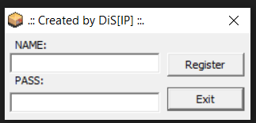
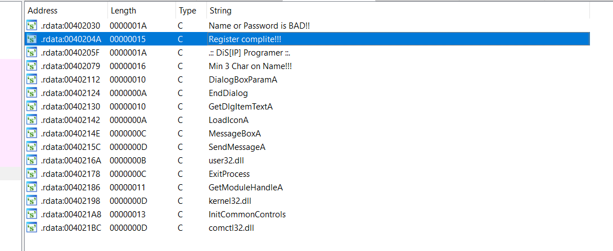
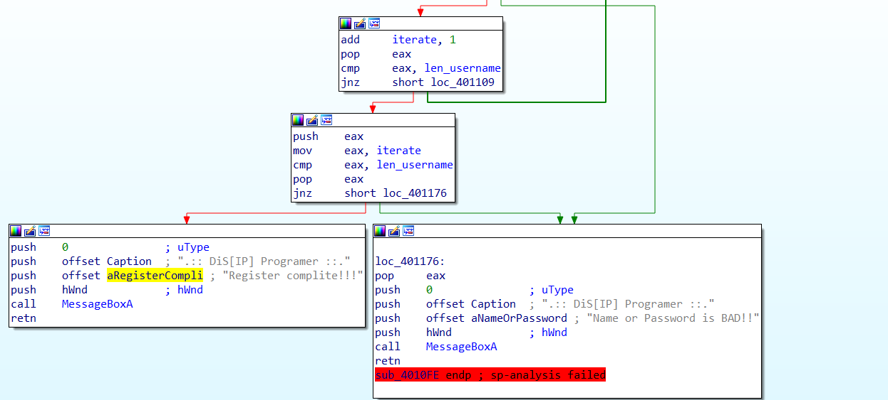
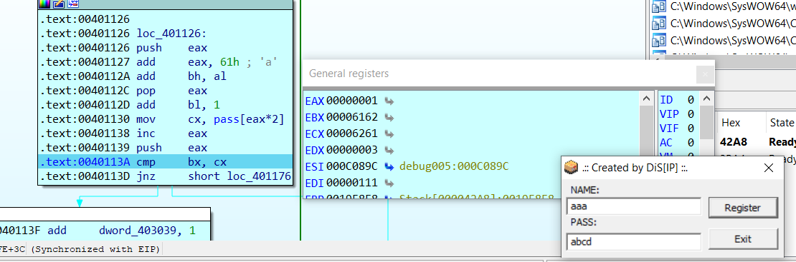
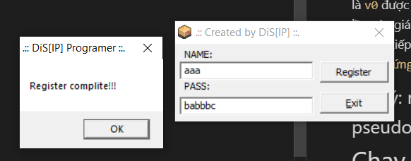

# **CRACK_001**

# Task 
File: Creakme.exe

Chạy thử file:



Sau khi kiểm tra thử một vài input nhập vào thì ta đoán bài này yêu cầu chúng ta có thể `register` thành công

## Solution

Đầu tiên ta chạy lệnh `file` để kiểm tra file là 32bit hay 64bit
```bash
└─$ file Creakme.exe
Creakme.exe: PE32 executable (GUI) Intel 80386, for MS Windows
```

File này là 32bit nên ta dùng IDA pro 32bit để reverse file này và phân tích

Bước đầu tiên thì ta luôn kiểm tra cửa sổ string trước (Shift + F12) chứa các chuỗi mà IDA tìm được trong chương trình

Đây là chuỗi chúng ta cần `Register complite!!!` và cũng là mục đích cuối cùng của chúng ta


Nhảy tới ví trí mà chương trình in ra chuỗi này và tiến hành dịch ngược


Nhấn F5 để hiện của sổ pseudocode, để phân tích dễ hơn 
Sau một vài phút phân tích, thì ta biết được flow của chương trình:

# phần 1 nhận input `username` và `password`
```c
INT_PTR __stdcall DialogFunc(HWND hWnd, UINT a2, WPARAM a3, LPARAM a4)
{
  HICON v4; // eax
  WPARAM v5; // eax
  UINT v6; // eax

  ::hWnd = hWnd;
  switch ( a2 )
  {
    case 0x110u:
      v4 = LoadIconA(hInstance, (LPCSTR)0xC8);
      SendMessageA(hWnd, 0x80u, 1u, (LPARAM)v4);
      break;
    case 0x111u:
      v5 = a3;
      if ( a3 == 1001 )
        v5 = SendMessageA(hWnd, 0x10u, 0, 0);
      if ( v5 == 1004 )
      {
        GetDlgItemTextA(hWnd, 1003, pass, 255);
        v6 = GetDlgItemTextA(hWnd, 1002, username, 255);
        if ( v6 < 3 )
        {
          MessageBoxA(hWnd, "Min 3 Char on Name!!!", ".:: DiS[IP] Programer ::.", 0);
        }
        else
        {
          len_username = v6;
          sub_4010FE();
        }
      }
      break;
    case 0x10u:
      EndDialog(hWnd, 0);
      break;
  }
  return 0;
}
```

Đoạn này chương trình sẽ đọc vào `username` và `password` lưu vào biến `pass` và `username`
`v6` là độ dài của chuỗi `username` và phải lớn hơn hoặc bằng 3 sau đó gọi hàm `sub_4010FE()` để kiểm tra input
```c
      if ( v5 == 1004 )
      {
        GetDlgItemTextA(hWnd, 1003, pass, 255);
        v6 = GetDlgItemTextA(hWnd, 1002, username, 255);
        if ( v6 < 3 )
        {
          MessageBoxA(hWnd, "Min 3 Char on Name!!!", ".:: DiS[IP] Programer ::.", 0);
        }
        else
        {
          len_username = v6;
          sub_4010FE();
        }
```

# Phần 2: lấy phần tử của `username` tính toán sau đó so sánh với phần tử chẵn của `password`
```c
/ positive sp value has been detected, the output may be wrong!
int sub_4010FE()
{
  int v0; // eax
  __int16 v1; // bx
  int v3; // [esp-8h] [ebp-8h]

  v0 = 0;
  iterate = 0;
  while ( 1 )
  {
    v1 = (unsigned __int8)username[v0];
    if ( (_BYTE)v1 == 'Z' )
      LOBYTE(v1) = 'Y';
    if ( (_BYTE)v1 == 'z' )
      LOBYTE(v1) = 'y';
    if ( (_BYTE)v1 == '9' )
      LOBYTE(v1) = '8';
    HIBYTE(v1) += v0 + 'a';
    LOBYTE(v1) = v1 + 1;
    v3 = v0 + 1;
    if ( v1 != *(_WORD *)&pass[2 * v0] )
      break;
    ++iterate;
    ++v0;
    if ( v3 == len_username )
    {
      if ( iterate == len_username )
        return MessageBoxA(hWnd, "Register complite!!!", ".:: DiS[IP] Programer ::.", 0);
      return MessageBoxA(hWnd, "Name or Password is BAD!!", ".:: DiS[IP] Programer ::.", 0);
    }
  }
  return MessageBoxA(hWnd, "Name or Password is BAD!!", ".:: DiS[IP] Programer ::.", 0);
}
```
Cách giải đơn giản cho bài này ta sẽ nhập một `username` bất kỳ sao đó tính ra được `password` cần tìm

Để đơn giản đoạn này ta sẽ nhập một `username` bypass 3 câu lệnh if đầu tiên 'aaa' ( khác 'Z', khác 'z' và khác '9')
```c
    v1 = (unsigned __int8)username[v0];
    if ( (_BYTE)v1 == 'Z' )
      LOBYTE(v1) = 'Y';
    if ( (_BYTE)v1 == 'z' )
      LOBYTE(v1) = 'y';
    if ( (_BYTE)v1 == '9' )
      LOBYTE(v1) = '8';
    HIBYTE(v1) += v0 + 'a';
    LOBYTE(v1) = v1 + 1;
    v3 = v0 + 1;
```
`v1` sẽ gồm 2 bytes:
-> byte thấp sẽ là v1(phần tử của `username`) + 1
-> byte cao sẽ là v0(vị trí phần tử của `username`) + 'a'


đoạn này sẽ lấy mỗi 2 bytes của `password` để so sánh với v1, nếu khác sẽ in ra sai.
```c
    if ( v1 != *(_WORD *)&pass[2 * v0] )
      break;
```
Tiến hành Debug để xác đinh chuỗi `password`

ở đoạn so sánh này `cx` sẽ chứa 2 bytes của `password` ở vị trí 2*`eax` (chẵn) sau đó so sánh với `bx` chính là `v0` được tính từ `username`
vậy giá trị của `password` tương ứng với `username` sẽ là giá trị của `bx`
ở lần này giá trị của `bx` = 0x6162 vậy `password` sẽ bắt đầu là `ba____`
tương tự thay đổi password và debug tiếp ta có giá trị của `bx` lần lượt là 0x6262 và 0x6362
vậy `password hoàn chỉnh sẽ là `babbbc` ứng với `username`= `aaa`

## Chú ý: nếu không debug trực tiếp thì ta có thể phân tích pseudocode ở trên cũng sẽ cho kết quả tương tự

# Chạy chương trình và nhập `username` và `password` vừa tìm được:


Done!!
