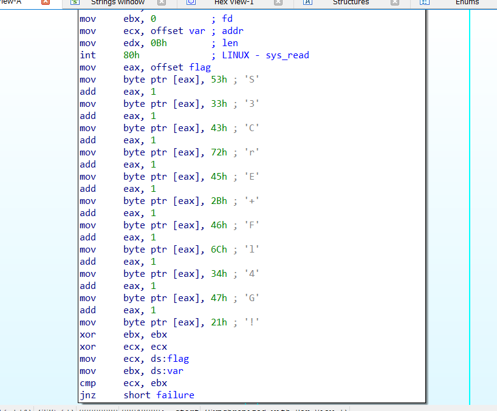

# **CRACK_NASM**

# Task 
File: CrackMe_ASM

Chạy thử file (chạy trên linux)

```bash
└─$ ./CrackMe_ASM
Flag : hello
you are wrong , try again !

Flag : abcd
you are wrong , try again !

Flag :
```

Chương trình yêu cầu chúng ta nhập vào `Flag` nếu sai in ra chuỗi `you are wrong, try again!!`

## Solution

Đầu tiên ta chạy lệnh `file` để kiểm tra file là 32bit hay 64bit
```bash
└─$ file CrackMe_ASM
CrackMe_ASM: ELF 32-bit LSB executable, Intel 80386, version 1 (SYSV), statically linked, not stripped
```
File 32bit nên chúng ta sài IDA pro 32 bit để reverse và tiến hành phân tích file.

Ở cửa sổ đầu tiên, ta đã thấy một chuỗi bất thường 


thử nhập chuỗi `S3Cre+Fl4G!` vào chương trình

```bash
└─$ ./CrackMe_ASM
Flag : S3Cre+Fl4G!
you are correct !
```

vậy ta đã giải xong challenge này :))

Easy gaming !