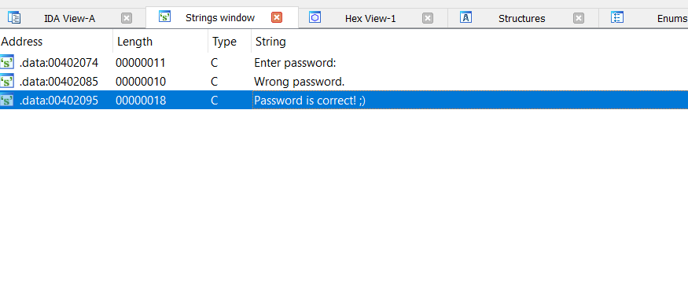
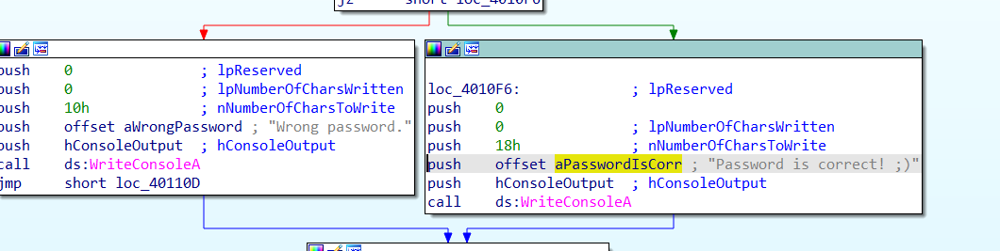

# **get_the_password**

#Task
Chạy thử file :

```bash
└─$./ crackme1.EXE
Enter password : abcde
Wrong password.
```

Bài này cũng yêu cầu chúng ta tìm `password` đúng

## Solution

Bước đầu sài lệnh `file` để kiểm tra file
```bash
└─$ file crackme1.EXE
crackme1.EXE: PE32 executable (console) Intel 80386, for MS Windows
```

Đây là file windows 32 bit

Nên ta dùng IDA pro 32 bit để tiến hành reverse và phân tích file

Mở cửa sổ string trước, ta thấy ngay chuỗi cần chương trình in ra `Password is correct ;)`


Nhảy tới vị trí chương trình in ra chuỗi này và phân tích 


Nhấp F5 để IDA phân sang Pseudocode, ta sử dụng Pseudocode để dễ phân tích hơn

```c
void __noreturn start()
{
  char v0; // cl
  int v1; // edx
  char *v2; // esi
  char v3; // al

  hConsoleInput = GetStdHandle(0xFFFFFFF6);
  hConsoleOutput = GetStdHandle(0xFFFFFFF5);
  WriteConsoleA(hConsoleOutput, aEnterPassword, 0x11u, 0, 0);
  ReadConsoleA(hConsoleInput, &password, 0x64u, &NumberOfCharsRead, 0);
  v0 = 0;
  v1 = 0;
  v2 = (char *)&password;
  while ( 1 )
  {
    while ( 1 )
    {
      v3 = *v2++;
      if ( v3 == 13 )
        goto Wrong;
      if ( ++v0 != 1 )
        break;
      ++v1;
      if ( (unsigned __int8)v3 <= 'G' )
        --v1;
    }
    switch ( v0 )
    {
      case 2:
        ++v1;
        if ( v3 >= 'm' )
          --v1;
        break;
      case 3:
        ++v1;
        if ( v3 != 'V' )
          --v1;
        break;
      case 4:
        ++v1;
        if ( (unsigned __int8)v3 < 'f' )
          --v1;
        break;
      case 5:
        ++v1;
        if ( (unsigned __int8)v3 > '3' )
          --v1;
        break;
      case 6:
        ++v1;
        if ( (unsigned __int8)v3 <= 'y' )
          --v1;
        break;
      case 7:
        ++v1;
        if ( v3 < '8' )
          --v1;
        break;
      case 8:
        ++v1;
        if ( v3 >= 'N' )
          --v1;
        break;
      case 9:
        ++v1;
        if ( v3 == 'R' )
          --v1;
        break;
      default:
        ++v1;
        if ( v3 != '2' )
          --v1;
Wrong:
        if ( v1 == 10 )
          WriteConsoleA(hConsoleOutput, aPasswordIsCorr, 0x18u, 0, 0);
        else
          WriteConsoleA(hConsoleOutput, aWrongPassword, 0x10u, 0, 0);
        ExitProcess(0);
    }
  }
}
```
đoạn code trên sẽ kiểm tra lần lượt `10` lần tương ứng với `10` ký tự của `password` nhập vào, nếu chỉ cần sai một ký tự in ra sai

Và quan trọng là nếu như `v1` (số lần lặp kiểm tra của các ký tự bên trong `password`) phải bằng `10` sau tất cả các lần kiểm tra, trong mỗi lần kiểm tra nếu ký tự thỏa điều kiện `if` thì `v1` sẽ bị giảm đi `1` như vậy để `v1` bằng `10` sau `10` lần kiểm tra thì tất cả các điều kiện trong mỗi `case` đều không thỏa

### Ta phân tích từng đoạn
 ```c
    while ( 1 )
    {
      v3 = *v2++;
      if ( v3 == 13 )
        goto Wrong;
      if ( ++v0 != 1 )
        break;
      ++v1;
      // ở đây ta chọn > 'G' nên sẽ là 'a'
      if ( (unsigned __int8)v3 <= 'G' )
        --v1;
    }
 ```

 đoạn này sẽ kiểm tra ký tự đầu tiên nếu có giá trị ASCII bằng `13` thì sẽ nhảy tới `Wrong` và ký tự đầu tiên phải > `G`, chọn `a`


## những lần tiếp theo
```c
    switch ( v0 )
    {
      case 2:
        ++v1;
        // ở đây ta chọn phải < 'm' nên sẽ là `a`
        if ( v3 >= 'm' )
          --v1;
        break;
      case 3:
        ++v1;
        // ở đây ta chọn phải == 'V' 
        if ( v3 != 'V' )
          --v1;
        break;
      case 4:
        ++v1;
        // ở đây ta chọn phải >= f nên sẽ là 'z'
        if ( (unsigned __int8)v3 < 'f' )
          --v1;
        break;
      case 5:
        ++v1;
        // ở dây ta chọn <= '3' nên sẽ là '2'
        if ( (unsigned __int8)v3 > '3' )
          --v1;
        break;
      case 6:
        ++v1;
        // ở đây ta chọn > 'y' nên sẽ là 'z'
        if ( (unsigned __int8)v3 <= 'y' )
          --v1;
        break;
      case 7:
        ++v1;
        // ở đây ta chọn >'8' nên sẽ là '9'
        if ( v3 < '8' )
          --v1;
        break;
      case 8:
        ++v1;
        // ở đây ta chọn < 'N' nên sẽ là 'A'
        if ( v3 >= 'N' )
          --v1;
        break;
      case 9:
        ++v1;
        // ở đây ta chọn khác 'R' nên sẽ là 'a'
        if ( v3 == 'R' )
          --v1;
        break;
      default:
        ++v1;
        // ở đây ta chọn == '2'
        if ( v3 != '2' )
          --v1;
```

Tổng kết các ký tự đã chọn thày chuỗi `password` cần tìm:
## password = `aaVz2z9Aa2`

## chạy thử chương trình với chuỗi `password` vừa tìm được

```bash
└─$ ./crackme1.EXE
Enter password: aaVz2z9Aa2
Password is correct! ;)
```

Done !