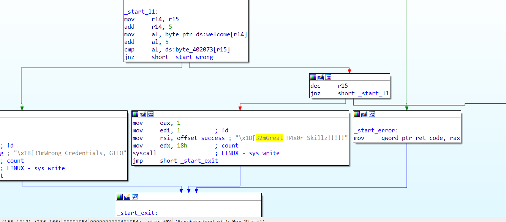
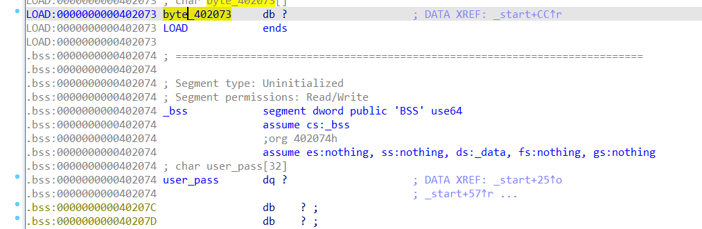

# **hello**

# Task
File : hello

Chạy thử file :
```bash
└─$ ./hello
Please enter your name: abcde
Hello abcde
Enter your Password: 12345
Wrong Credentials,
```
Chương trình sẽ yêu cầu nhập vào `username` và `password` sau đó xác thực `username` và `password` đó

##Solution

Kiểm tra file bằng lệnh `file`

```bash
└─$ file hello
hello : ELF 64 - bit LSB executable, x86 - 64, version 1(SYSV), statically linked, not stripped
```

File linux 64bit nên ta dùng IDA pro để reverse và phân tích 



Không cần phân tích nhiều thì ta đã thấy được chuỗi mà ta muốn chương trình in ra `Great H4x0r Skillz!!!!!`


Đây là đoạn pseudocode: 

```c
void __noreturn start()
{
  signed __int64 v0; // rax
  __int64 v1; // rax
  signed __int64 v2; // rax
  signed __int64 v3; // rax
  signed __int64 v4; // r15
  signed __int64 v5; // rax
  signed __int64 v6; // rax
  signed __int64 v7; // rax

  v0 = sys_write(1u, msg, 0x19uLL);
  v1 = sys_read(0, user_pass, 0x20uLL);
  if ( v1 < 0 )
  {
    ret_code = v1;
    goto _start_exit;
  }
  *(_QWORD *)welcome = *(_QWORD *)hello;
  *(_QWORD *)&welcome[6] = *(_QWORD *)user_pass;
  v2 = sys_write(1u, welcome, v1 + 6);
  v3 = sys_write(1u, prompt, 0x16uLL);

  v4 = sys_read(0, user_pass, 0x20uLL) - 1;
  while ( welcome[v4 + 5] + 5 == byte_402073[v4] )
  {
    if ( !--v4 )
    {
      v5 = sys_write(1u, success, 0x18uLL);
_start_exit:
      v7 = sys_exit((int)&ret_code);
      JUMPOUT(0x40112DLL);
    }
  }
  v6 = sys_write(1u, wrong, 0x18uLL);
  goto _start_exit;
}
```

Ta thấy bài này đơn giản là nhập vào `username` sau đó nối `username` với vị trí của string được lưu sẵn `hello` và cuối cùng in ra toàn bộ dòng `hello username` 

Tiếp theo sẽ nhập vào `password` nhưng cũng sẽ đọc vào vùng nhớ của `username` đã nhập vào ở trên

với `v4` là độ dài của chuỗi password nhập vào trừ đi 1

Kiểm tra điều kiện:
```c
  while ( welcome[v4 + 5] + 5 == byte_402073[v4] )
  {
    if ( !--v4 )
    {
      v5 = sys_write(1u, success, 0x18uLL);
_start_exit:
      v7 = sys_exit((int)&ret_code);
      JUMPOUT(0x40112DLL);
    }
  }
```

vị trí `v4` + `5` sẽ là vị trí của ký tự cuối cùng của chuỗi `username` nhập vào cho đến khi `--v4==0` sẽ in ra dòng chúng ta muốn

`byte_402073` nằm tại vị trí trước `user_pass` một ô nhớ 
`byte_402073` ở vị trí `0x402073`
`user_pass` ở vị trí `0x402074`


Vậy `byte_402073[v4]` sẽ chính là `user_pass[v4-1]`

dòng kiểm tra sẽ là lấy từng phần tử đầu đến cuối của `username` + `5` (`welcome[v4 + 5] + 5`) so sánh với phần từ cuối đến đầu của `password` nhập vào nếu khác sẽ in ra sai 

để đơn giản ta nhập `username` là `Hello`
giả sử `password` chỉ có `3` phần tử thì sẽ được tạo ra từ `Hel` của `username`
vậy `password[0]` = `l` + 5 = `q`
    `password[1]` = `e` + 5 = `j`
    `password[3]` = `H` + 5 = `M`

Vì file ở dạng LSB nên chuỗi `password` sẽ là `Mjq`

## Chạy chương trình với `username` và `password` vừa tìm được 
```bash
└─$ ./hello
Please enter your name: Hello
Hello Hello
Enter your Password: Mjq
Great H4x0r Skillz!
```

hoặc có `username` chỉ cần 3 ký tự ứng với `password`
```bash 
Please enter your name: Hel
Hello Hel
Enter your Password: Mjq
Great H4x0r Skillz!┌
```

Done !