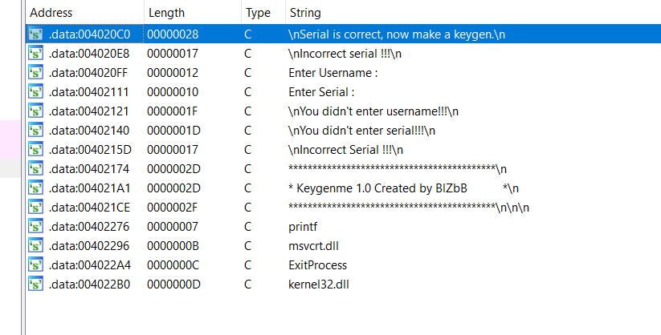
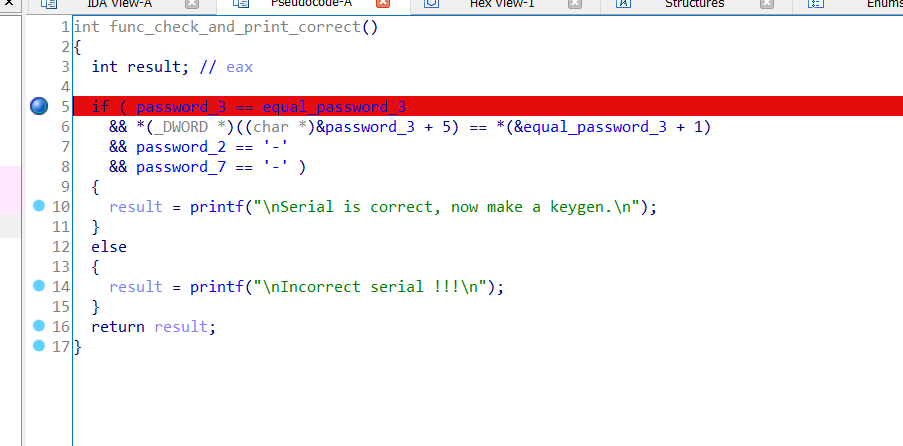
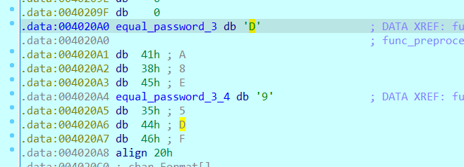

# **keygen**

# task
File: Keygenme#1.exe 

Chạy thử file:

```bash
└─$ ./Keygenme#1.exe
*******************************************
* Keygenme 1.0 Created by BlZbB           *
*******************************************


Enter Username : hello
Enter Serial : abcde

Incorrect Serial !!!

```

Chương trình yêu cầu nhập vào `username` và `serial` sau đó chương trình sẽ kiểm tra nếu không đúng sẽ in ra dòng `Incorrect Serial` 

Vậy mục đích của chúng ta trong bài này là tìm `username` và `Serial` tương ứng để in ra một hiển thị Serial đúng.

##Solution

Đầu tiên ta chạy lệnh `file` để kiểm tra file là 32bit hay 64bit
```bash
└─$ file Keygenme#1.exe
Keygenme#1.exe: PE32 executable (console) Intel 80386, for MS Windows
```
File windows 32bit nên ta dùng IDA pro 32bti để reverse và phân tích file này

Đầu tiên chúng ta mở cửa sổ string để kiểm tra các chuỗi mà IDA tìm được trong chương trình

Thấy ngay chuỗi mà ta muốn chương trình in ra `Serial is correct, now make a keygen.`

nhảy tới vị trí mà chương trình in ra chuỗi đó và bắt đầu phân tích dịch ngược chương trình

Nhấn F5 sử dụng pseudocode để phân tích dễ dàng hơn, ta thấy flow của chương trình 
gồm 3 phần chính

Phần một, bắt đầu chương trình và gọi hàm `sub_4010F9()` để xử lí
```c
void __noreturn start()
{
  int v0; // eax

  printf("*******************************************\n");
  printf("* Keygenme 1.0 Created by BlZbB           *\n");
  printf("*******************************************\n\n\n");
  v0 = sub_4010F9();
  ExitProcess(v0);

```

Phần tiếp theo là phần code của hàm `sub_4010F9()`
```c
int sub_4010F9()
{
  int v0; // ecx

  printf("Enter Username : ");
  if ( *(_BYTE *)gets(&username) )
  {
    printf("Enter Serial : ");
    if ( *(_BYTE *)gets(&password) )
    {
      sub_4010C0();
      if ( v0 == 3 )
      {
        func_preprocess_before_check();
        func_check_and_print_correct();
      }
      else
      {
        printf("\nIncorrect Serial !!!\n");
      }
    }
    else
    {
      printf("\nYou didn't enter serial!!!\n");
    }
  }
  else
  {
    printf("\nYou didn't enter username!!!\n");
  }
  getc((FILE *)iob[0]._ptr);
  return 0;
}
```

### chú ý: các tên hàm đã được mình phân tích và sửa lại cho dễ hiểu source chứ mặc định IDA load lên sẽ ko có những cái tên dễ đọc như vậy.

Để chương trình in ra chuỗi mà chúng ta muốn thì trước tiên ta phải làm cho chương trình gọi được hàm `func_check_and_print_correct()`. Tuy nhiên trước khi gọi hàm này thì chương trình phải gọi hàm `sub_4010C0()` và hàm `func_preprocess_before_check()` vì hàm `sub_4010C0()` được gọi tuy nhiên không ảnh hưởng đến flow của chương trình nên mình không tiến hành đổi tên hàm này.
Còn hàm `func_preprocess_before_check()` có ảnh hưởng đến flow của chương trình nên mình đã đổi tên cho dễ phân biệt 


Trước khi đi vào hàm `func_preprocess_before_check()`
thì ta sẽ phân tích hàm `func_check_and_print_corect()` bởi vì hàm này không đơn giản là in ra câu lệnh đúng mà nó còn kiểm tra điều kiện trước khi in ra.
```c
int func_check_and_print_correct()
{
  int result; // eax

  if ( password_3 == equal_password_3
    && *(_DWORD *)((char *)&password_3 + 5) == *(&equal_password_3 + 1)
    && password_2 == '-'
    && password_7 == '-' )
  {
    result = printf("\nSerial is correct, now make a keygen.\n");
  }
  else
  {
    result = printf("\nIncorrect serial !!!\n");
  }
  return result;
}
```
Ở đây thì mình cũng đã tiến hành phân tích và đổi tên các biến tương ứng,
`password_3` = `password[3]` - phần tử thứ 4 của chuỗi `password`
tương tự cho `password_2`,`password_7` sẽ phải bằng một ký tự đó là `-` = `password[2]` = `password[7]`

`equal_password_3` sẽ là một biến mà biến đó sẽ bằng với `password[3]`
tuy nhiên ta phân tích kĩ hơn trong code assembly thì `password_3`==`equal_password_3` sẽ được load ra 4 bytes từ bị trí đó của từng biến và so sánh với nhau

Tương tự như vậy, thì `*(_DWORD *)((char *)&password_3 + 5) == *(&equal_password_3 + 1)` sẽ so sánh 4 bytes từ vị trí `password[8]` với 4 bytes từ vị trí tiếp theo của `equal_password_3` (`equal_password_3 + 1`)

Từ đây ta xác định được `password` nhập vào sẽ sẽ có độ dài tối thiểu là `12` và chuỗi chung ta xác định sẽ là `aa-XXXX-XXXX` với `XXXX` sẽ là giá trị của `password_3` và `password_3+1` (do hai ký tự đầu không được so sánh nên ta chọn bất kỳ là `aa`)


Tiếp theo tiến hành phân tích hàm `func_preprocess_before_check()`
vì trong hàm này sẽ ảnh hưởng trên biến `equal_password_3` cho nên mình mới xác định là hàm này sẽ ảnh hướng đến flow của chương trình

### Chú ý: hầu hết các tên biến, đã được mình debug và phần tích để sửa thành các tên dễ phân biệt và nhận dạng, chứ IDA không tự đặt tên theo như vậy, thường thì IDA sẽ đặt tên theo địa chỉ mà biến đó đang được lưu
```c
int func_preprocess_before_check()
{
  _BYTE *v0; // edi
  int v1; // ecx
  bool v2; // zf
  unsigned __int8 v3; // cl
  int v4; // ebx
  unsigned __int8 *v5; // esi
  unsigned __int8 v6; // al
  int v7; // ebx
  int result; // eax
  int *reference_to_equal_password_3; // esi
  int v10; // ecx

  v0 = &username;
  v1 = 255;
  do
  {
    if ( !v1 )
      break;
    v2 = *v0++ == 0;
    --v1;
  }
  while ( !v2 );
  v3 = -(char)v1 - 2;
  v4 = 0;
  v5 = (unsigned __int8 *)&username;
  do
  {
    v6 = *v5++;
    v4 += (unsigned __int16)(v3 * v6);
    ++v0;
    --v3;
  }
  while ( v3 );
  v7 = ~(v4 ^ 0x13131313) ^ 0x1234ABCD;
  result = v7 & 252645135;
  equal_password_3 = v7 & 252645135;
  equal_password_3_4 = (v7 & 0xF0F0F0F0) >> 4;
  reference_to_equal_password_3 = &equal_password_3;
  v10 = 8;
  do
  {
    if ( *(_BYTE *)reference_to_equal_password_3 > 9u )
      *(_BYTE *)reference_to_equal_password_3 += 55;
    else
      *(_BYTE *)reference_to_equal_password_3 |= 48u;
    reference_to_equal_password_3 = (int *)((char *)reference_to_equal_password_3 + 1);
    --v10;
  }
  while ( v10 );
  return result;
}
```
Phân tích kĩ code thì ta thấy chủ yếu hàm này sẽ lấy các phần tử của username sau đó thực hiện tính toán và lưu vào địa chỉ của `equal_password_3` và `equal_password_3 + 1` (vì biến `reference_to_equal_pasword_3` là biến tham chiếu tới `equal_password_3` nên khi biến `reference_to_equal_password_3` thay đổi thì `equal_password_3` cũng thay đổi )

Giải pháp cực kỳ đơn giản cho bài này chính là ta sẽ nhập một `username` bất kỳ (độ dài >= 12 ít nhất nên bằng độ dài `password`) sau đó thực hiện debug rồi xem giá trị tại địa chỉ `equal_password_3` và `equal_password_3 + 1` thì chắc chắn ta sẽ biết được password


ta đặt breakpoint ngay trước khi kiểm tra điều kiện bước cuối. Vì vậy nên các giá trị tại `equal_password_3` đã được tính toán xong 

Ở đây ta thấy giá trị của `equal_password_3` = `DA8E` của `equal_password_3 + 1` = `95DF` với chuỗi `username` nhập vào là `aaaabbbbcccc`


Vậy password ứng với `username` = `aaaabbbbcccc` là `aa-DA8E-95DF`

## Chạy lại chương trình và nhập `username` và `password` vừa tìm được 

```bash
└─$ ./Keygenme#1.exe
*******************************************
* Keygenme 1.0 Created by BlZbB           *
*******************************************


Enter Username : aaaabbbbcccc
Enter Serial : aa-DA8E-95DF

Serial is correct, now make a keygen.

```

Done !