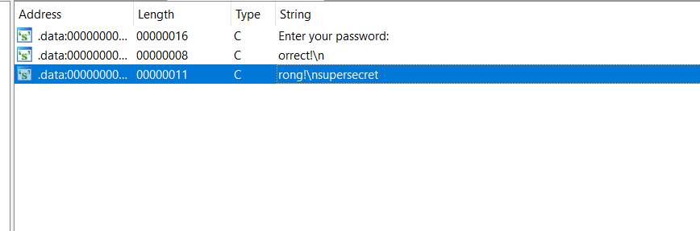

# **nasm**

# Task
File: nasm

Chạy thử file:

```bash
└─$ ./nasm
Enter your password: hello
Wrong!
```
Challenge này cũng yêu cầu chúng ta tim đúng `password`

## Solution

Dùng lệnh `file` để kiểm tra file 32bit hay 64bit
```bash
└─$ file nasm
nasm: ELF 64-bit LSB executable, x86-64, version 1 (SYSV), statically linked, not stripped
```

File linux 64bit nên ta dùng IDA pro 64bit để reverse và phân tích file

Mở cửa sổ string và ta thấy ngay `password` và không cần phân tích gì cả :)))


## `password` = `supersecret`

## Chạy file và nhập `password` vừa tìm được 
```bash
└─$ ./nasm
Enter your password: supersecret
Correct!
```
Done !
